# SOLID-Kotlin
Projeto de estudo baseado nos principais conceitos sobre o SOLID.

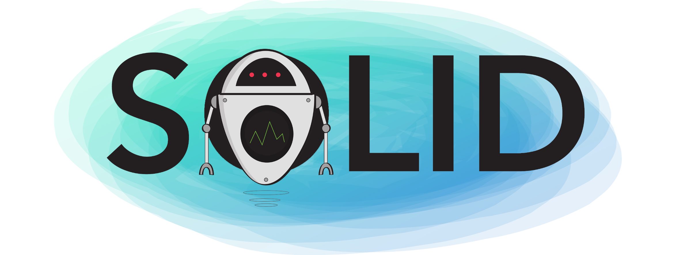

## O que é o SOLID?

> O SOLID são cinco princípios da programação orientada a objetos que facilitam no desenvolvimento de softwares, tornando-os fáceis de manter e estender. Esses princípios podem ser aplicados a qualquer linguagem de POO.

## Por que é tão importante aprender esses conceitos?

É importante porque esses princípios são a base para vários Padrões e Projetos e tornam softwares mais evolutivos, de fácil manutenção e facilita mudanças necessárias após a finalização do projeto, não impactando em outras áreas do programa. De fato, podemos afirmar que um software que não segue tais princípios é um software mal escrito e de má qualidade. 

## Os princípios do SOLID

1. S **— Single Responsibility Principle** (Princípio da Responsabilidade Única)
2. O **— Open-Closed Principle** (Princípio Aberto-Fechado)
3. L **— Liskov Substitution Principle** (Princípio da Substituição de Liskov)
4. I **— Interface Segregation Principle** (Princípio da Segregação da Interface)
5. D **— Dependency Inversion Principle** (Princípio da Inversão da Dependência)

## Single Responsibility Principle 

> Princípio da Responsabilidade Única — ***Uma classe deve ter um, e somente um, motivo para mudar***.

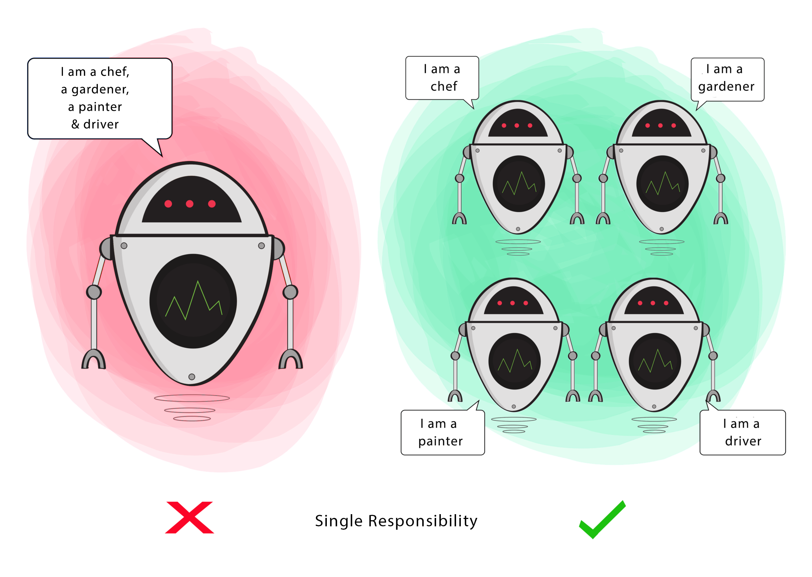

Esse princípio declara que uma classe deve ser especializada em um único assunto e possuir apenas uma responsabilidade dentro do software, ou seja, a classe deve ter uma única tarefa ou ação para executar.

Indo um pouco mais fundo, podemos dizer que para o sistema esteja de acordo com esse princípio, cada responsabilidade deve ser uma classe e cada classe deve ter uma única responsabilidade.

**Veja um exemplo:**

```kotlin
class ModeloErrado {

    class Robot{

        fun chef(){/*...*/}
        fun gardener(){/*...*/}
        fun painter(){/*...*/}
        fun driver(){/*...*/}

    }

}
```

A classe `Robot ` viola o Single Responsiblity Principle (SRP) porque realiza 4 tipos distintos de tarefas, ou seja, ela executa ações diferentes em uma mesma classe. Lembre-se, o princípio da responsabilidade única preza que *uma classe deve ter um, e somente um, motivo para mudar*.  

**A violação do Single Responsibility Principle pode gerar alguns problemas, sendo eles:**

- **Falta de coesão** — uma classe não deve assumir responsabilidades que não são suas. Classes não coesas têm uma grande chance de terem defeitos. Toda classe que é não coesa ***não para de crescer nunca***.
- **Alto acoplamento** — Mais responsabilidades geram um maior nível de dependências, deixando o sistema engessado e frágil para alterações;
- **Dificuldades na implementação de testes automatizados** — É difícil de *“mockar”* *esse tipo de classe;*
- **Dificuldades para reaproveitar o código.**

> **Mock ou Mockar :** Em desenvolvimento de software são objetos que simulam o comportamento de objetos reais de forma controlada. São normalmente criados para testar o comportamento de outros objetos. 

> **Coesão:** uma classe coesa é aquela que possui uma única responsabilidade. Além disso, elas são vitais em um sistema orientado a objetos. 

> **Acoplamento:** É a união ou ligação entre dois ou mais corpos, formando um único conjunto. Esse corpo pode ser representado por classes, entidades, métodos, componentes, tabelas etc. Quando falamos, por exemplo, de relacionamento entre Classes, Tabelas, Domínios, Sub-Sistemas, Casos de Uso etc. estamos falando de acoplamento. Podemos afirmar que no contexto de um software *qualquer relacionamento gera acoplamento*.
>
> - **Baixo Acoplamento** — Quando um sistema possui entre seus componentes uma relação de **interdependência fraca**, significa que a **dependência entre seus componentes** é baixa, ou seja, estão acoplados, **mas fracamente acoplados**. 
> - **Alto Acoplamento** — Quando um sistema possui entre seus componentes uma relação de **interdependência forte**, significa que a **dependência entre seus componentes** é alta, ou seja, estão acoplados, **mas fortemente acoplados**.
>
>  

Aplicando o Single Responsiblity Principle (SRP) na classe `Robot `, podemos refatorar o código da seguinte forma:

```kotlin
class ModeloCorreto {

    open class Robot{

        class Chef:Robot(){
            fun cook(){/*...*/}
        }
        class Gardener:Robot(){
            fun plant(){/*...*/}
        }
        class Painter:Robot(){
            fun paint(){/*...*/}
        }
        class Driver:Robot(){
            fun drive(){/*...*/}
        }

    }

}
```

Note que no exemplo acima que agora temos 4 classes, cada uma cuidando da sua responsabilidade.

> Esse princípio é um dos mais importantes, ele acaba sendo a base para outros princípios e padrões, além disso ela aborda temas como acoplamento e coesão, características que todo código orientado a objetos deveria ter.

**O uso do princípio do Single Responsibility Principle gera os seguintes benefícios, sendo eles:**

- **Uso de classes coesas:** Classes coesas tendem a ter menos código, são mais simples de serem mantidas, são menos suscetíveis a problemas, o seu reuso é mais fácil e a chance de propagarem problemas para outras classes é menor. 
- **Ela também pode ser aplicada para métodos e funções:** tudo que é responsável por executar uma ação, deve ser responsável por apenas aquilo que se propõe a fazer. 

> Não ache que você conseguirá escrever classes coesas o tempo todo, e de primeira. Escrever código de qualidade é sempre incremental; você modela, observa seu modelo, aprende com ele e o melhora.

Aplicando esse princípio, automaticamente você estará escrevendo um código mais limpo e de fácil manutenção.

## Open-Closed Principle 

> Princípio do Aberto-Fechado — ***Você deve ser capaz de estender um comportamento de uma classe sem a necessidade de modificá-lo***.


Esse princípio diz que *você deve ser capaz de estender um comportamento de uma classe sem a necessidade de modificá-lo*, ou seja, quando novos comportamentos e recursos precisam ser adicionados no software, devemos estender e não alterar o código fonte original.

**Veja um exemplo:**

```kotlin
class ModeloErrado {

    open class Robot{/*...*/}

    class Cutter:Robot(){
        fun cut(){/*...*/}
    }
    class Painter:Robot(){
        fun paint(){/*...*/}
    }

    class Work{

        fun working(robot:Robot){
            if(robot is Cutter) println("I can´t cut")
            else if (robot is Painter) println("Now, I can paint")

        }
    }
}
```

A classe `Work `precisa verificar a classe `Robot ` para aplicar qual tipo de trabalho o robô faz. Supondo que o robô faça mais do que só cortar e pintar, obviamente seria necessário modificar essa classe! Sendo assim, estaríamos quebrando o princípio do Open-Closed Principle.

**A violação do Open-Closed Principle pode gerar alguns problemas, sendo eles:**

- **Alteração de classe:** Quando alterarmos uma classe já existente para adicionar um novo comportamento, corremos um sério risco de introduzir bugs em algo que já estava funcionando.
- **Classes altamente testáveis:** A partir do momento em que a classe deixa clara todas as suas dependências, e possibilita a troca delas, criamos classes facilmente extensíveis.

Aplicando o Open-Closed Principle (OCP) na classe `ModeloCorreto `, podemos refatorar o código da seguinte forma:

```kotlin
class ModeloCorreto {

    interface Work{
        fun paint()
        fun cut()
    }

    class Robot:Work{

        override fun cut(){/*...*/}
        override fun paint(){/*...*/}

        fun print() = println("Now, I can cut & paint")

    }
    
}
```

A classe `Robot` não precisa saber quais são os tipos de trabalho do robô. Ela será capaz de executar diretamente as ações dos tipos de trabalho do robô (que é cortar e pintar, respectivamente) — *desde que ele implemente a interface* `Work` *—* sem qualquer necessidade de alteração do seu código fonte. Dessa forma, acabamos de implementar o Open-Closed Principle em nosso código.

## Liskov Substitution Principle

> Princípio da Substituição de Liskov — ***As classes derivadas devem ser substituíveis por suas classes bases***.

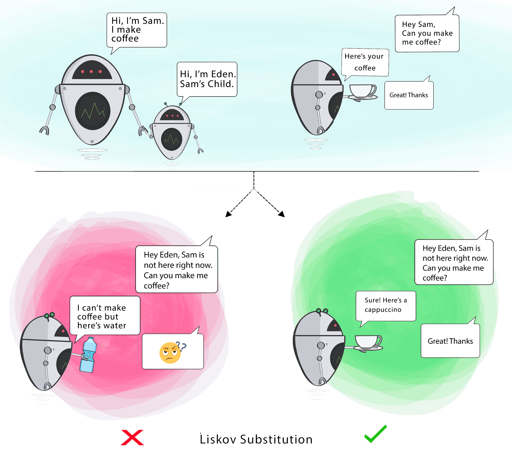

```kotlin
class ModeloErrado {

    open class RobotSam{

        open fun serveCoffee() = println("Here´s your coffee")

    }
    //A classe RobotEden é um subtipo da classe RobotSam.
    class RobotEden: RobotSam() {
        
        //Mais ele não serve café, somente água.
        override fun serveCoffee(){/*...*/}

        fun serveWater() = println("I can´t make coffee but here´s water")
        
    }

}
```


```kotlin
class ModeloCorreto {

    open class RobotSam{

        open fun serveCoffee() = println("Here´s your coffee")

    }
    class RobotEden: RobotSam() {

        override fun serveCoffee() = println("Here´s a cappuccino")

    }

}
```

## Interface Segregation Principle 

> Princípio da Segregação de Interfaces — ***Muitas interfaces específicas são melhores do que uma interface única geral***.


```kotlin
class ModeloErrado {

    interface Exercises{
        fun spinAround()
        fun rotateArms()
        fun wiggleAntennas()
    }
    
    class RobotWithAntennas:Exercises{

        override fun spinAround() {/*..*/}
        override fun rotateArms() {/*..*/}
        override fun wiggleAntennas() {/*..*/}

    }
    
    //A classe RobotNotAntennas é um robô mais não possui antenas.
    class RobotNotAntennas:Exercises{

        override fun spinAround() {/*..*/}
        override fun rotateArms() {/*..*/}
        
        //A Interface Exercises está forçando a Classe RobotNotAntennas a implementar esse método.
        //Isso viola o príncipio do Interface Segregation Principle e do Liskov Substitution Principle também.
        override fun wiggleAntennas() = println("Oops! But I don´t have antennas")


    }

}
```


```kotlin
class ModeloCorreto {

    interface Exercices{/*...*/}

    interface CanSpinAround:Exercices{
        fun spinAround()
    }
    interface CanRotateArms:Exercices{
        fun rotateArms()
    }
    interface CanWiggleAntennas:Exercices{
        fun wiggleAntennas()
    }

    class RobotWithAntennas:CanRotateArms, CanSpinAround, CanWiggleAntennas{

        override fun spinAround() {/*...*/}
        override fun rotateArms() {/*...*/}
        override fun wiggleAntennas() {/*...*/}

        fun print() = println("Awesome!")

    }
    class RobotNotAntennas:CanRotateArms, CanSpinAround{

        override fun spinAround() {/*...*/}
        override fun rotateArms() {/*...*/}

        fun print() = println("Awesome!")

    }

}
```

## Dependency Inversion Principle

> Princípio da Inversão de Dependência — ***Dependa de abstrações e não de implementações***.

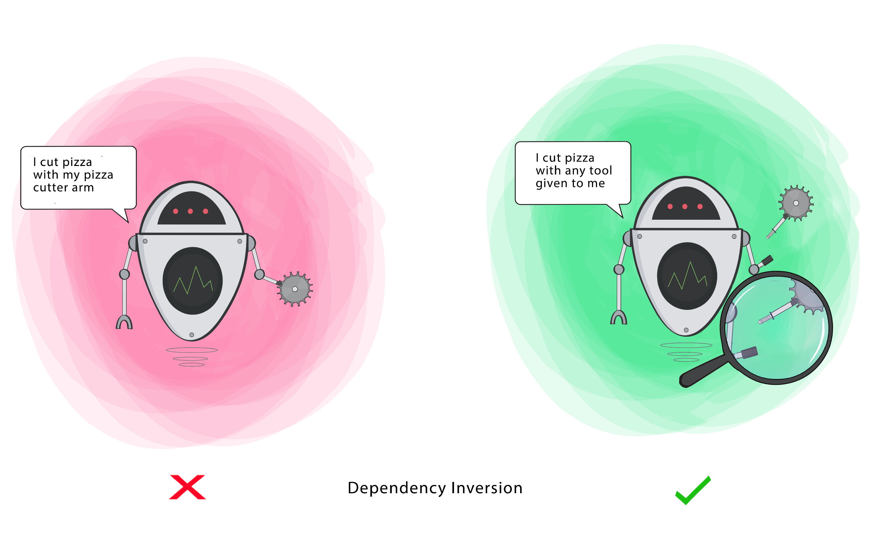

```kotlin
class ModeloErrado {

    class Robot{

        private val cutterArm:CutterArm = CutterArm()

        fun cutPizza(){
            cutterArm.cut()
            println("I cut pizza with my pizza cutter arm")
        }

    }
    class CutterArm{

        fun cut(){}

    }

}
```

No exemplo, podemos perceber que além de quebrar outros princípios do SOLID, a classe concreta *Interruptor* depende de uma outra classe concreta *Ventilador*. O Interruptor deveria ser capaz de acionar qualquer dispositivo independente de ser um ventilador uma lâmpada ou até mesmo um carro.

```kotlin
class ModeloCorreto {

    interface Tool{

        fun cutterArm()
        //Example
        //fun knifeArm()
    }

    class Robot{

        fun print() = println("I cut with any tool given to me")

        class Cutter(private val tool:Tool){

            fun cutPizza() = tool.cutterArm()
            //Example
            //fun cutPizza() = tool.knifeArm()

        }
    }

}
```
## Diagramas de Classe

- **Single Responsibility Principle**

  | 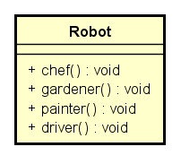 | **Errado**🚫 |
  | :---------------------------------: | :---------: |
  | 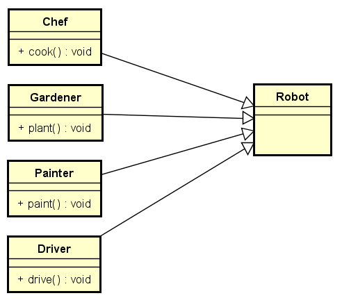 | **Certo**✅  |

- **Open-Closed Principle**

  | 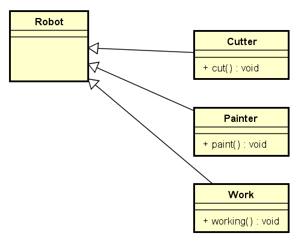 | **Errado**🚫 |
  | :---------------------------------: | :---------: |
  | 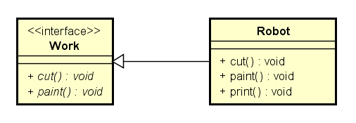 | **Certo**✅  |

- **Liskov Substitution Principle**

  | 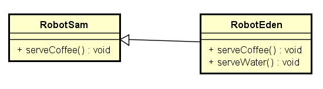 | **Errado**🚫 |
  | :---------------------------------: | :---------: |
  | 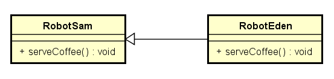 | **Certo**✅  |

- **Interface Segregation Principle**

  | 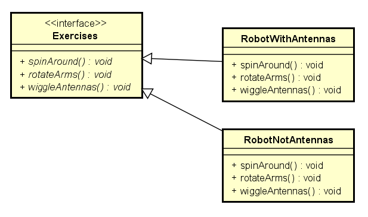 | **Errado**🚫 |
  | :---------------------------------: | :---------: |
  | 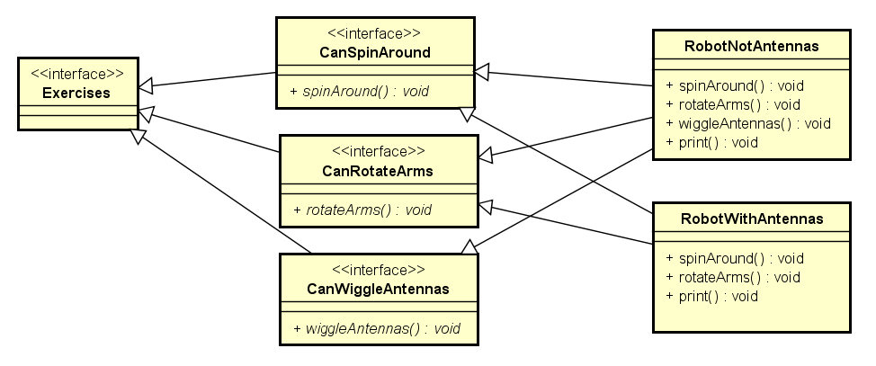 | **Certo**✅  |

- **Dependency Inversion Principle**

  | 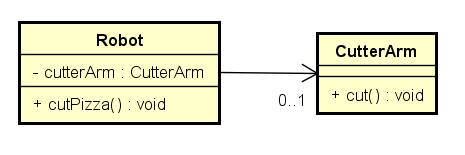 | **Errado**🚫 |
  | :---------------------------------: | :---------: |
  | 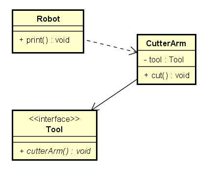 | **Certo**✅  |

   


## Fontes

1. https://medium.com/desenvolvendo-com-paixao/o-que-%C3%A9-solid-o-guia-completo-para-voc%C3%AA-entender-os-5-princ%C3%ADpios-da-poo-2b937b3fc530
2. https://medium.com/thiago-aragao/solid-princ%C3%ADpios-da-programa%C3%A7%C3%A3o-orientada-a-objetos-ba7e31d8fb25
3. https://medium.com/backticks-tildes/the-s-o-l-i-d-principles-in-pictures-b34ce2f1e898
